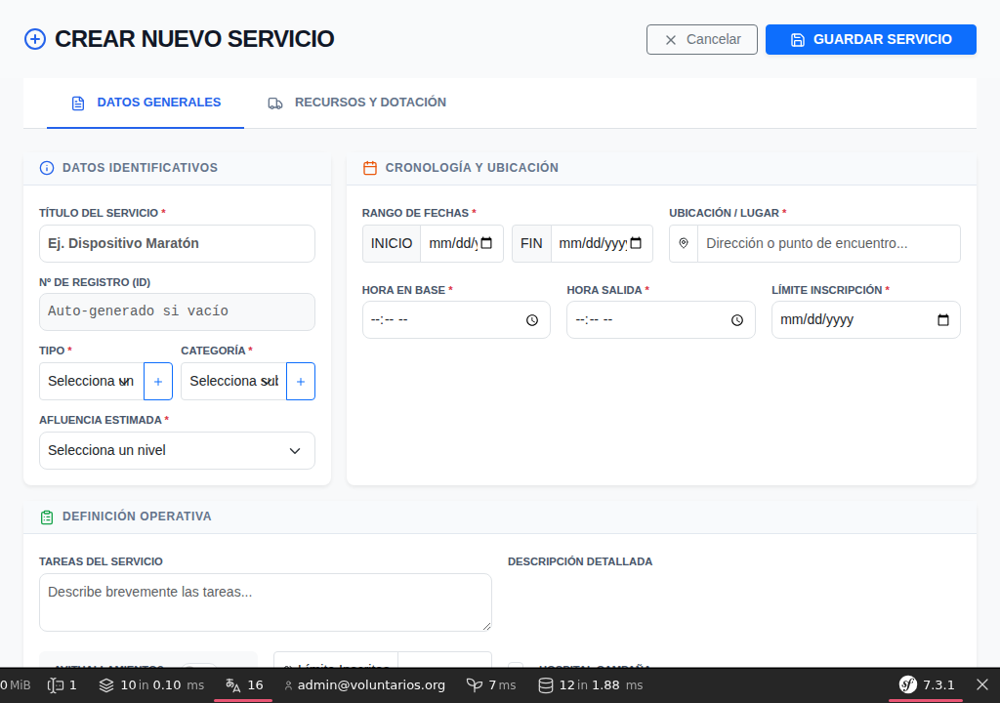
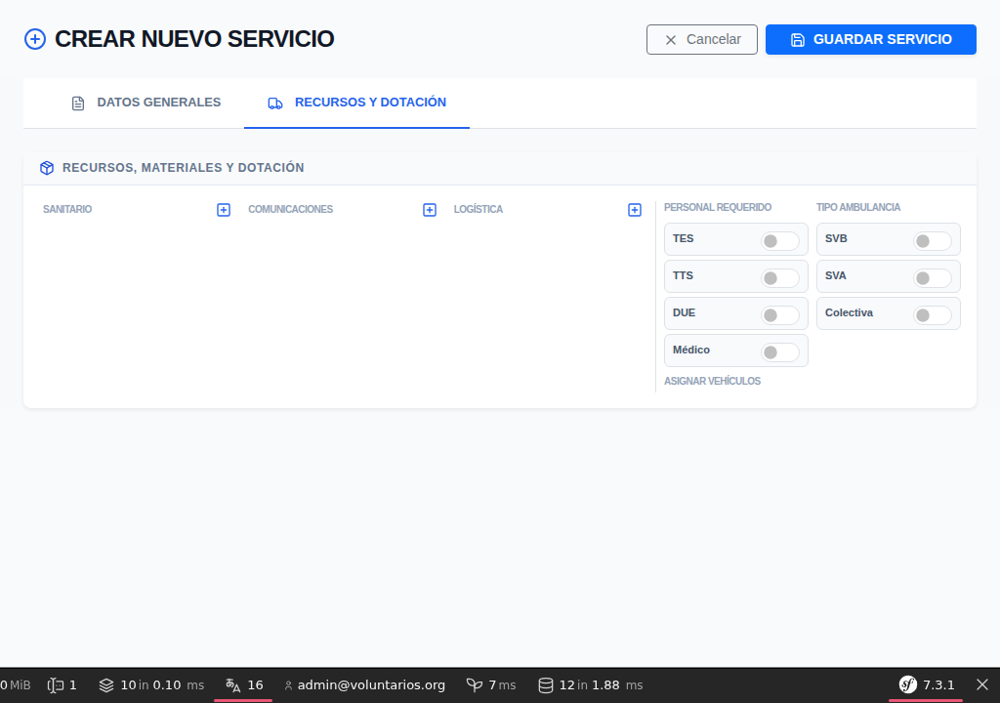

# Manual de Usuario para Administradores
## Sistema de Gestión - Protección Civil de Vigo

Este manual proporciona las instrucciones necesarias para administrar el sistema de gestión del voluntariado, servicios y recursos de Protección Civil de Vigo.

---

## 1. Acceso al Sistema

Para acceder al panel de administración:
1. Navegue a la URL de la aplicación.
2. Introduzca sus credenciales:
   - **Usuario:** `admin@voluntarios.org`
   - **Contraseña:** `admin123` (se recomienda cambiarla tras el primer acceso).

### Panel de Control (Dashboard)
Una vez dentro, verá un resumen de la actividad:
- Servicios activos y próximos.
- Estado global del voluntariado.
- Accesos rápidos a las funciones principales.

---

## 2. Gestión de Voluntarios

El módulo de voluntarios permite gestionar el capital humano de la agrupación.

### Alta de un Voluntario
1. Acceda a **Voluntarios** > **Nuevo Voluntario**.
2. Complete los datos personales, de contacto y cualificaciones.
3. **Estado:**
   - **Pendiente:** El voluntario se ha registrado pero espera aprobación.
   - **Activo:** Puede inscribirse en servicios.
   - **Inactivo:** No aparecerá en las listas de selección actuales.

### Roles y Especialidades
Es importante marcar las especialidades (TES, DUE, Médico, etc.) ya que esto permitirá al sistema filtrar quién puede cubrir ciertos puestos en los servicios.

---

## 3. Gestión de Servicios

Este es el núcleo de la aplicación. Los servicios se dividen en dos fases principales de configuración.

### Paso 1: Datos Generales
En esta pestaña se define la naturaleza del evento.

- **Título y Tipo:** Obligatorios.
- **Fechas y Horas:** **¡Importante!** Debe establecer las fechas de inicio y fin antes de pasar a la siguiente pestaña, ya que el sistema las necesita para calcular la disponibilidad de materiales y vehículos.
- **Ubicación:** Punto de encuentro o lugar del servicio.

### Paso 2: Recursos y Dotación
Aquí se asigna "qué y quién" va al servicio.

- **Personal Requerido:** Active los perfiles necesarios (TES, TTS, DUE...).
- **Materiales:**
  - Al añadir materiales (Sanitario, Comunicaciones, Logística), el sistema mostrará la disponibilidad en tiempo real para las fechas elegidas.
  - **Validación de Stock:** Si intenta asignar más unidades de las disponibles para esas fechas, el sistema marcará el campo en rojo.
  - **Filtro Inteligente:** En la columna "Sanitario", el sistema solo mostrará materiales de tipo "Sanitario" que sean "Equipo Técnico".
  - **Identificar Unidad:** Para equipos técnicos (como desfibriladores o walkies), puede seleccionar una unidad específica. Si una unidad está ocupada en otro servicio o en mantenimiento, aparecerá marcada como **(OCUPADO)** en rojo.
- **Vehículos:** Seleccione los vehículos que se desplazarán.

---

## 4. Control de Asistencia (Fichajes)

El sistema permite registrar exactamente cuánto tiempo dedica cada voluntario.

- **Inscripción:** Los voluntarios se apuntan a través de su panel. El administrador puede mover voluntarios de la "Lista de Reserva" a la "Lista Principal".
- **Fichaje Individual:** Al inicio del servicio, se puede marcar la entrada de cada voluntario.
- **Fichaje Masivo:** Ideal para servicios grandes. Permite registrar la entrada o salida de todos los participantes a la vez.

---

## 5. Inventario y Almacén

### Gestión de Materiales
El sistema diferencia entre:
- **Consumibles:** Material que se gasta (gasas, guantes). Se gestiona por stock numérico.
- **Equipo Técnico:** Material inventariado (DESA, Camillas). Se gestiona por unidades individuales con número de serie/alias.

### Importación desde Excel
Para cargas masivas de datos:
1. Use el formato de 22 columnas (de la A a la V).
2. El sistema detectará si el material ya existe (por nombre o código de barras) y actualizará el stock, o creará uno nuevo si no existe.

### Gestión de Botiquines (Kits)
Los botiquines se gestionan como unidades individuales con una ubicación tipo "KIT".
1. **Plantillas:** En el módulo de Kits, defina qué productos y qué cantidad debe contener cada tipo de botiquín (ej. Mochila de Intervención vs Botiquín de Coche).
2. **Reposición (Refill):** Esta es la función más potente. Al seleccionar un botiquín y pulsar "Reponer", el sistema:
   - Comprueba qué le falta al botiquín según su plantilla.
   - Busca ese material en el **Almacén Central (ALMACEN)**.
   - Transfiere automáticamente el stock del almacén al botiquín.

---

## 6. Flota de Vehículos

En el módulo de **Vehículos**, se puede llevar el control de:
- Matrículas, marcas y modelos.
- Estado operativo (Operativo / En Taller).
- Tipo de combustible y equipamiento fijo asignado.

---

## 7. Informes y Reportes

Acceda a **Informes** para obtener:
- Resumen de horas por voluntario (útil para certificaciones).
- Estadísticas de servicios por tipo o mes.
- Histórico de uso de materiales críticos.

---

## 8. Consejos de Uso y Troubleshooting

- **"Esperando fechas...":** Si al intentar añadir material le aparece este mensaje, es porque no ha definido las fechas de inicio y fin en la pestaña de "Datos Generales". El sistema no puede calcular el stock sin saber cuándo se usará.
- **Cambio de Contraseña:** Por seguridad, las contraseñas deben tener al menos 12 caracteres e incluir mayúsculas, minúsculas y números o símbolos.
- **Importación de Excel:** Si el sistema da error al importar, verifique que no ha cambiado el orden de las columnas del archivo original.

---

*© 2024 Protección Civil de Vigo - Sistema de Gestión Interna*
